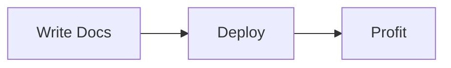

# 📚 MDX Knowledge Base

> **Beautiful documentation that developers actually want to write.**

Stop fighting with complex documentation platforms. Start writing docs in Markdown with the power of React components. Your team will thank you.

## ✨ Why This Exists

Documentation shouldn't be painful. You shouldn't need a PhD to set up a docs site, and your writers shouldn't need to learn a proprietary CMS.

**This is documentation for the modern era:**
- Write in **MDX** (Markdown + JSX) - the format developers already know
- Get **instant previews** with hot reload
- Add **interactive components** without leaving your editor
- Deploy anywhere in seconds

## 🎯 What Makes This Different

### 🚀 Blazingly Fast
Built on Next.js 15 with Turbopack. Your docs load instantly. Your builds finish in seconds. Your users stay happy.

### 🎨 Gorgeous Out of the Box
A stunning purple-accent theme with perfect typography, smooth dark mode, and syntax highlighting that actually pops. No design skills required.

### 💪 Powerful When You Need It
- **Live code blocks** with syntax highlighting (Shiki)
- **Interactive diagrams** with Mermaid
- **Custom components** - tabs, callouts, cards, file trees
- **Smart table of contents** that tracks your scroll
- **Full-text search** ready to go

### 🎯 Simple When You Don't
Drop an `.mdx` file in `content/docs/`. That's it. The routing, navigation, and metadata are handled automatically.

## 🚀 Quick Start

```bash
# Clone the repository
git clone https://github.com/arttus/mdx-kb.git
cd mdx-kb

# Install dependencies
npm install

# Start the dev server
npm run dev
```

Open [http://localhost:3000](http://localhost:3000) and see your docs come alive.

### Or Use as a Template

Click the **"Use this template"** button on GitHub to create your own repository based on this project.

## 📝 Writing Docs

Create a new file in `content/docs/`:

```mdx
---
title: "Your Amazing Feature"
description: "How to use it and why it's awesome"
---

# Your Amazing Feature

Write your docs in **Markdown**. Add React components when you need them.

<Callout type="info">
  This is a custom component. Use it anywhere.
</Callout>

\`\`\`typescript
// Code blocks with beautiful syntax highlighting
const magic = true;
\`\`\`
```

That's it. No build step. No configuration. Just write.

## 🎨 Features That Wow

### Interactive Code Blocks
```typescript
// Syntax highlighting that actually looks good in dark mode
function greet(name: string) {
  return `Hello, ${name}!`;
}
```

### Live Diagrams


### Smart Components
Use tabs, callouts, cards, and more - all built-in and ready to use.

## 🛠️ Tech Stack

- **Next.js 15** - The React framework for production
- **React 19** - With the new React Compiler
- **MDX 3** - Markdown meets JSX
- **Tailwind CSS 4** - Utility-first styling
- **Shiki** - Beautiful syntax highlighting
- **TypeScript** - Type safety throughout

## 🎯 Perfect For

- **Product documentation** - Help your users succeed
- **API references** - Make your API easy to understand
- **Internal wikis** - Knowledge sharing that doesn't suck
- **Technical blogs** - Write once, look professional forever
- **Developer portals** - Everything your devs need in one place

## 🚢 Deploy Anywhere

```bash
# Build for production
npm run build

# Deploy to Vercel (recommended)
vercel deploy

# Or anywhere else that runs Node.js
```

Works on Vercel, Netlify, AWS, your own server - anywhere Next.js runs.

## 🎨 Customization

### Change the Theme
Edit `src/app/globals.css` to customize colors, fonts, and spacing. The theme system uses CSS variables for easy customization.

### Add Custom Components
Create components in `src/components/mdx/` and add them to `mdx-components.tsx`. Use them in any MDX file.

### Modify the Layout
Edit `src/components/layout/` to change the header, sidebar, or table of contents.

## 📖 Documentation Structure

```
content/docs/
├── introduction.mdx
├── installation.mdx
├── guides/
│   ├── writing-mdx.mdx
│   ├── code-blocks.mdx
│   └── diagrams.mdx
└── api/
    ├── configuration.mdx
    └── theming.mdx
```

The file structure becomes your navigation. Nested folders create sections. It just works.

## 🤝 Contributing

Found a bug? Want a feature? PRs welcome!

## 📄 License

MIT - Use it however you want.

---

**Built with ❤️ for developers who care about documentation.**

Stop settling for ugly docs. Start shipping beautiful knowledge.

