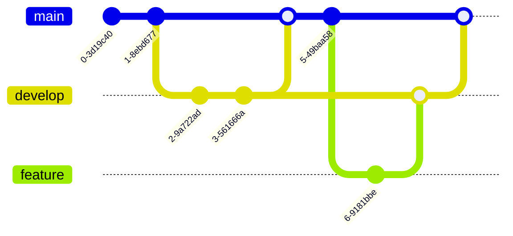

# Diagrams

Create stunning diagrams directly in your documentation using Mermaid syntax.

## Flowcharts

Create flowcharts to visualize processes:

## Sequence Diagrams

Show interactions between components:

## Class Diagrams

Document your code structure:

## State Diagrams

Visualize state machines:

## Gantt Charts

Create project timelines:

## Pie Charts

Show data distributions:

## Git Graphs

Visualize Git workflows:

<Callout type="info">
  All diagrams automatically adapt to your theme (light/dark mode).
</Callout>

## Tips for Great Diagrams

1. **Keep it simple** - Don't overcomplicate diagrams
2. **Use clear labels** - Make nodes and edges descriptive
3. **Choose the right type** - Pick the diagram that best fits your needs
4. **Add context** - Explain what the diagram shows
5. **Test rendering** - Preview before publishing

## Supported Diagram Types

Mermaid supports many diagram types:

- Flowcharts
- Sequence diagrams
- Class diagrams
- State diagrams
- Entity relationship diagrams
- Gantt charts
- Pie charts
- Git graphs
- And more!

## Next Steps

- [Components](/docs/guides/components) - Explore custom components
- [Configuration](/docs/api/configuration) - Customize diagram themes