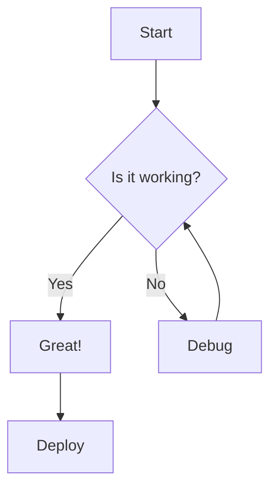

# Quick Start

Let's create your first documentation page and explore the key features.

## Create Your First Page

Create a new MDX file in the `content/docs` directory:

```mdx title="content/docs/my-first-page.mdx"
---
title: "My First Page"
description: "This is my first documentation page"
---

# My First Page

Welcome to my documentation!

## Features

- Easy to write
- Beautiful by default
- Fully customizable
```

## Add Code Examples

MDX Knowledge Base supports syntax highlighting for over 50 languages:

```javascript title="hello.js" {2,4-6}
function sayHello(name) {
  console.log(`Hello, ${name}!`);
  
  return {
    message: `Hello, ${name}!`,
    timestamp: new Date()
  };
}

sayHello("World");
```

## Use Custom Components

### Callouts

<Callout type="info" title="Did you know?">
  You can use custom React components directly in your MDX files!
</Callout>

<Callout type="warning">
  Make sure to follow best practices when writing documentation.
</Callout>

<Callout type="error">
  This is an error message. Use it to highlight critical information.
</Callout>

<Callout type="success">
  Great job! You're learning fast.
</Callout>

### Tabs

Use tabs to show multiple options or code examples:

<Tabs defaultValue="react">
  <TabsList>
    <TabsTrigger value="react">React</TabsTrigger>
    <TabsTrigger value="vue">Vue</TabsTrigger>
    <TabsTrigger value="angular">Angular</TabsTrigger>
  </TabsList>
  <TabsContent value="react">
    ```jsx
    function App() {
      return <h1>Hello from React!</h1>;
    }
    ```
  </TabsContent>
  <TabsContent value="vue">
    ```vue
    <template>
      <h1>Hello from Vue!</h1>
    </template>
    ```
  </TabsContent>
  <TabsContent value="angular">
    ```typescript
    @Component({
      template: '<h1>Hello from Angular!</h1>'
    })
    export class AppComponent {}
    ```
  </TabsContent>
</Tabs>

## Create Diagrams

Use Mermaid to create beautiful diagrams:



## What's Next?

Now that you've created your first page, explore more features:

- [Writing MDX](/docs/guides/writing-mdx) - Learn advanced MDX techniques
- [Code Blocks](/docs/guides/code-blocks) - Master code highlighting
- [Diagrams](/docs/guides/diagrams) - Create complex diagrams
- [Components](/docs/guides/components) - Use custom components