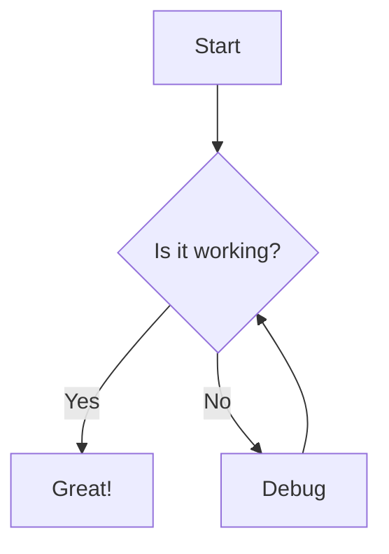

# MDX Knowledge Base Specification
## React + MDX with Code Blocks & Mermaid Diagrams

---

## 1. Project Overview

A modern, performant MDX Knowledge Base application built with React and MDX that supports rich content including code syntax highlighting, Mermaid diagrams, and a beautiful UI powered by shadcn/ui and Tailwind CSS.

### Core Requirements
- Write documentation in MDX (Markdown + JSX)
- Syntax-highlighted code blocks with Shiki
- Mermaid diagram rendering
- Responsive, accessible UI with shadcn/ui
- Fast navigation and search
- Dark/light theme support
- Server Components by default
- Client Components only when needed (interactivity)

---

## 2. Tech Stack

### Core Framework
- **React 19** - UI library
- **Next.js 15** (App Router) - React framework with file-based routing and Turbopack
- **TypeScript** - Type safety

### Content & Rendering
- **MDX 3** - Markdown with JSX components
- **next-mdx-remote** or **@next/mdx** - MDX processing
- **Shiki** - Modern code syntax highlighting
- **Mermaid** - Diagram rendering

### UI & Styling
- **Tailwind CSS 4** - Modern utility-first styling with CSS-first config
- **shadcn/ui** - High-quality React components
- **Radix UI** - Accessible component primitives (via shadcn)
- **lucide-react** - Icon library

### Additional Tools
- **gray-matter** - Frontmatter parsing
- **rehype/remark plugins** - MDX processing pipeline
- **Fuse.js** - Client-side search (optional)

---

## 3. Architecture

### Directory Structure

```
knowledge-base/
├── app/
│   ├── layout.tsx                 # Root layout with theme provider
│   ├── page.tsx                   # Home page
│   ├── docs/
│   │   ├── layout.tsx            # Docs layout with sidebar
│   │   ├── [slug]/
│   │   │   └── page.tsx          # Dynamic doc page
│   │   └── [...slug]/
│   │       └── page.tsx          # Nested doc pages
│   └── api/
│       └── search/
│           └── route.ts          # Search API endpoint
├── components/
│   ├── ui/                       # shadcn components
│   │   ├── button.tsx
│   │   ├── card.tsx
│   │   ├── navigation-menu.tsx
│   │   └── ...
│   ├── mdx/
│   │   ├── code-block.tsx        # Custom code block component
│   │   ├── mermaid.tsx           # Mermaid diagram wrapper
│   │   ├── callout.tsx           # Info/warning callouts
│   │   └── mdx-components.tsx    # MDX component mappings
│   ├── layout/
│   │   ├── header.tsx
│   │   ├── sidebar.tsx
│   │   ├── table-of-contents.tsx
│   │   └── theme-toggle.tsx
│   └── search/
│       └── search-bar.tsx
├── content/
│   └── docs/
│       ├── getting-started.mdx
│       ├── installation.mdx
│       └── guides/
│           └── advanced-usage.mdx
├── lib/
│   ├── mdx.ts                    # MDX processing utilities
│   ├── docs.ts                   # Doc retrieval logic
│   └── utils.ts                  # General utilities
├── styles/
│   └── globals.css              # Tailwind directives
├── public/
│   └── ...
├── tailwind.config.ts
├── components.json              # shadcn config
├── next.config.js
├── mdx-components.tsx           # Global MDX components
└── package.json
```

---

## 4. Key Features

### 4.1 MDX Content Processing

**Frontmatter Support**
```yaml
---
title: "Getting Started"
description: "Learn how to use the MDX Knowledge Base"
date: "2024-01-15"
category: "basics"
tags: ["intro", "setup"]
---
```

**MDX Processing Pipeline**
- Parse frontmatter with gray-matter
- Transform MDX with remark/rehype plugins
- Inject custom components
- Generate table of contents from headings

### 4.2 Code Block Features

**Syntax Highlighting**
- Support for 50+ languages
- Line numbers (optional)
- Line highlighting
- File name display
- Copy to clipboard button
- Theme: GitHub Dark/Light or custom

**Example Usage in MDX:**
````mdx
```typescript title="example.ts" {3,5-7}
function greet(name: string): string {
  return `Hello, ${name}!`;
}

const message = greet("World");
console.log(message);
```
````

**Features:**
- `title` - Display filename
- `{3,5-7}` - Highlight specific lines
- Language detection from fence info

### 4.3 Mermaid Diagram Support

**Component Features**
- Client-side rendering with `mermaid.js`
- Lazy loading for performance
- Theme sync with site theme
- Error handling with fallback UI
- Zoom/pan support (optional)

**Example Usage:**
````mdx

````

**Supported Diagram Types:**
- Flowcharts
- Sequence diagrams
- Class diagrams
- State diagrams
- ER diagrams
- Gantt charts
- Pie charts
- Git graphs

### 4.4 Custom MDX Components

**Callout Component**
```mdx
<Callout type="info">
  This is an informational callout
</Callout>
```

Types: `info`, `warning`, `error`, `success`

**Tabs Component**
```mdx
<Tabs defaultValue="npm">
  <TabsList>
    <TabsTrigger value="npm">npm</TabsTrigger>
    <TabsTrigger value="yarn">Yarn</TabsTrigger>
  </TabsList>
  <TabsContent value="npm">
    ```bash
    npm install package
    ```
  </TabsContent>
  <TabsContent value="yarn">
    ```bash
    yarn add package
    ```
  </TabsContent>
</Tabs>
```

**File Tree Component**
```mdx
<FileTree>
  - app/
    - layout.tsx
    - page.tsx
  - components/
    - button.tsx
</FileTree>
```

### 4.5 Navigation & Search

**Sidebar Navigation**
- Hierarchical structure
- Active page highlighting
- Collapsible sections
- Mobile-responsive drawer

**Table of Contents**
- Auto-generated from headings (h2, h3)
- Sticky positioning
- Scroll spy for active section
- Desktop only (hidden on mobile)

**Search**
- Full-text search across all docs
- Keyboard shortcuts (⌘K / Ctrl+K)
- Fuzzy matching
- Preview snippets in results

### 4.6 Theme System

**Dark/Light Mode**
- System preference detection
- Manual toggle
- Persisted in localStorage
- CSS variables for theming
- Smooth transitions

---

## 5. Component Specifications

### 5.1 CodeBlock Component

```typescript
interface CodeBlockProps {
  children: string;
  className?: string;
  title?: string;
  highlightLines?: number[];
  showLineNumbers?: boolean;
}
```

**Features:**
- Extract language from className (`language-typescript`)
- Syntax highlighting with Shiki or Prism
- Line number gutter
- Copy button with success feedback
- Title bar for filename
- Highlighted lines with different background
- Horizontal scroll for long lines

### 5.2 Mermaid Component

```typescript
interface MermaidProps {
  chart: string;
  id?: string;
}
```

**Implementation:**
- Use `useEffect` to render after mount
- Generate unique ID for each diagram
- Handle theme changes
- Error boundary for invalid syntax
- Loading state

### 5.3 MDX Components Mapping

```typescript
const mdxComponents = {
  // Override default HTML elements
  h1: ({ children }) => <h1 className="text-4xl font-bold mb-4">{children}</h1>,
  h2: ({ children }) => <h2 className="text-3xl font-bold mt-8 mb-4">{children}</h2>,
  h3: ({ children }) => <h3 className="text-2xl font-semibold mt-6 mb-3">{children}</h3>,
  p: ({ children }) => <p className="mb-4 leading-7">{children}</p>,
  pre: CodeBlock,
  code: InlineCode,
  a: ({ href, children }) => <Link href={href} className="text-primary underline">{children}</Link>,
  
  // Custom components
  Callout,
  Tabs,
  TabsList,
  TabsTrigger,
  TabsContent,
  Card,
  FileTree,
  Mermaid,
};
```

---

## 6. Styling Guidelines

### Tailwind CSS 4 Configuration

Tailwind CSS 4 uses a **CSS-first configuration** approach. Configuration is done directly in your CSS file.

```css
/* app/globals.css */
@import "tailwindcss";

/* Theme Configuration */
@theme {
  /* Color Palette */
  --color-background: oklch(100% 0 0);
  --color-foreground: oklch(9% 0.005 285.824);
  --color-card: oklch(100% 0 0);
  --color-card-foreground: oklch(9% 0.005 285.824);
  --color-primary: oklch(11.2% 0.018 285.824);
  --color-primary-foreground: oklch(98% 0.005 285.824);
  --color-muted: oklch(96.1% 0.004 285.824);
  --color-muted-foreground: oklch(45.1% 0.005 285.824);
  --color-accent: oklch(96.1% 0.004 285.824);
  --color-accent-foreground: oklch(9% 0.005 285.824);
  --color-code-bg: oklch(96.1% 0.004 285.824);
  
  /* Border & Radius */
  --radius-sm: 0.25rem;
  --radius-md: 0.375rem;
  --radius-lg: 0.5rem;
  --radius-xl: 0.75rem;
  
  /* Typography customization */
  --font-sans: ui-sans-serif, system-ui, sans-serif;
  --font-mono: ui-monospace, 'Cascadia Code', 'Source Code Pro', Menlo, monospace;
}

/* Dark mode */
@media (prefers-color-scheme: dark) {
  @theme {
    --color-background: oklch(9% 0.005 285.824);
    --color-foreground: oklch(98% 0.005 285.824);
    --color-card: oklch(9% 0.005 285.824);
    --color-card-foreground: oklch(98% 0.005 285.824);
    --color-muted: oklch(17.5% 0.013 285.824);
    --color-code-bg: oklch(17.5% 0.013 285.824);
  }
}

/* Class-based dark mode */
.dark {
  @theme {
    --color-background: oklch(9% 0.005 285.824);
    --color-foreground: oklch(98% 0.005 285.824);
    --color-card: oklch(9% 0.005 285.824);
    --color-card-foreground: oklch(98% 0.005 285.824);
    --color-muted: oklch(17.5% 0.013 285.824);
    --color-code-bg: oklch(17.5% 0.013 285.824);
  }
}

/* Custom utilities */
@utility tab-*{
  tab-size: *;
}

/* Container queries (built-in with Tailwind 4) */
@layer utilities {
  .container-queries {
    container-type: inline-size;
  }
}

/* Base styles */
@layer base {
  * {
    border-color: var(--color-border);
  }
  
  body {
    background-color: var(--color-background);
    color: var(--color-foreground);
    font-family: var(--font-sans);
  }
  
  code {
    background-color: var(--color-code-bg);
    padding: 0.25rem 0.375rem;
    border-radius: var(--radius-md);
    font-family: var(--font-mono);
    font-weight: 600;
  }
}
```

### postcss.config.mjs

```javascript
/** @type {import('postcss-load-config').Config} */
const config = {
  plugins: {
    '@tailwindcss/postcss': {},
  },
};

export default config;
```

---

## 7. Next.js 15 Specific Features & Considerations

### Caching Changes

**Important:** Next.js 15 changed the default caching behavior:

```typescript
// Fetch requests are NO LONGER cached by default
// To enable caching, explicitly set:
fetch('https://api.example.com/data', {
  cache: 'force-cache' // or 'no-store'
});

// Or use the cache config in route segment
export const dynamic = 'force-static'; // Enable caching for route
export const revalidate = 3600; // Revalidate every hour
```

### Turbopack Support

Enable Turbopack for faster local development:

```bash
# Development with Turbopack (default in Next.js 15)
npm run dev --turbo

# Or update package.json
{
  "scripts": {
    "dev": "next dev --turbo",
    "build": "next build",
    "start": "next start"
  }
}
```

### React 19 Features

Take advantage of new React 19 hooks in your components:

```typescript
import { use } from 'react';

// Use async data directly in components
function DocContent({ docsPromise }) {
  const docs = use(docsPromise);
  return <article>{docs.content}</article>;
}

// Form actions with useFormStatus
import { useFormStatus } from 'react-dom';

function SubmitButton() {
  const { pending } = useFormStatus();
  return (
    <button disabled={pending}>
      {pending ? 'Searching...' : 'Search'}
    </button>
  );
}
```

### Partial Prerendering (PPR)

Enable experimental PPR for better performance:

```typescript
// next.config.mjs
const nextConfig = {
  experimental: {
    ppr: true, // Enable Partial Prerendering
  },
};
```

### Server Actions

Improved Server Actions for forms and mutations:

```typescript
// app/actions.ts
'use server';

export async function searchDocs(formData: FormData) {
  const query = formData.get('query');
  // Perform search
  return results;
}

// app/search/page.tsx
import { searchDocs } from './actions';

export default function SearchPage() {
  return (
    <form action={searchDocs}>
      <input name="query" />
      <button type="submit">Search</button>
    </form>
  );
}
```

---

## 8. Configuration Files

### next.config.mjs

```javascript
import createMDX from '@next/mdx';
import remarkGfm from 'remark-gfm';
import remarkMath from 'remark-math';
import rehypeSlug from 'rehype-slug';
import rehypeAutolinkHeadings from 'rehype-autolink-headings';
import rehypePrettyCode from 'rehype-pretty-code';

/** @type {import('next').NextConfig} */
const nextConfig = {
  pageExtensions: ['js', 'jsx', 'md', 'mdx', 'ts', 'tsx'],
  
  // Next.js 15 improvements
  turbo: {
    rules: {
      '*.mdx': {
        loaders: ['@mdx-js/loader'],
        as: '*.js',
      },
    },
  },
};

const withMDX = createMDX({
  extension: /\.mdx?$/,
  options: {
    remarkPlugins: [
      remarkGfm,
      remarkMath,
    ],
    rehypePlugins: [
      rehypeSlug,
      [
        rehypeAutolinkHeadings,
        {
          behavior: 'wrap',
          properties: {
            className: ['anchor'],
          },
        },
      ],
      [
        rehypePrettyCode,
        {
          theme: {
            dark: 'github-dark',
            light: 'github-light',
          },
          keepBackground: false,
          onVisitLine(node) {
            // Prevent lines from collapsing in `display: grid` mode
            if (node.children.length === 0) {
              node.children = [{ type: 'text', value: ' ' }];
            }
          },
          onVisitHighlightedLine(node) {
            node.properties.className?.push('highlighted');
          },
          onVisitHighlightedChars(node) {
            node.properties.className = ['word'];
          },
        },
      ],
    ],
  },
});

export default withMDX(nextConfig);
```

### package.json dependencies

```json
{
  "dependencies": {
    "react": "^19.0.0",
    "react-dom": "^19.0.0",
    "next": "^15.0.0",
    "@next/mdx": "^15.0.0",
    "@mdx-js/loader": "^3.0.0",
    "@mdx-js/react": "^3.0.0",
    "gray-matter": "^4.0.3",
    "remark-gfm": "^4.0.0",
    "remark-math": "^6.0.0",
    "rehype-slug": "^6.0.0",
    "rehype-autolink-headings": "^7.1.0",
    "rehype-pretty-code": "^0.13.0",
    "shiki": "^1.0.0",
    "mermaid": "^10.9.0",
    "@tailwindcss/postcss": "^4.0.0",
    "tailwindcss": "^4.0.0",
    "class-variance-authority": "^0.7.0",
    "clsx": "^2.1.0",
    "tailwind-merge": "^2.2.0",
    "lucide-react": "^0.344.0",
    "@radix-ui/react-navigation-menu": "^1.1.4",
    "@radix-ui/react-tabs": "^1.0.4",
    "@radix-ui/react-dialog": "^1.0.5",
    "@radix-ui/react-dropdown-menu": "^2.0.6",
    "next-themes": "^0.2.1",
    "cmdk": "^0.2.0"
  },
  "devDependencies": {
    "@types/node": "^20.11.0",
    "@types/react": "^19.0.0",
    "@types/react-dom": "^19.0.0",
    "typescript": "^5.3.0",
    "postcss": "^8.4.0",
    "eslint": "^8.57.0",
    "eslint-config-next": "^15.0.0"
  }
}
```

### Key Version Notes

**React 19**
- Improved Server Components
- Better hydration errors
- New hooks: `use()`, `useOptimistic()`, `useFormStatus()`
- React Compiler support

**Next.js 15**
- Stable support for React 19
- Turbopack for faster local development (stable)
- Improved caching behavior (fetch requests are no longer cached by default)
- Better Server Actions
- Partial Prerendering (PPR) improvements
- Enhanced `next/image` and font optimization

**Tailwind CSS 4**
- CSS-first configuration (no more JS config file needed)
- Modern color functions (oklch, oklab)
- Smaller bundle size
- Improved performance
- Native cascade layers support
- Container query utilities built-in
- No more JIT mode (it's always on)

---

## 9. Performance Considerations

### Optimization Strategies

1. **Code Splitting**
   - Dynamic imports for Mermaid (client-side only)
   - Lazy load syntax highlighter
   - Route-based code splitting via Next.js
   - React Server Components for zero JS when possible

2. **MDX Compilation**
   - Compile MDX at build time with turbo mode
   - Cache compiled output
   - Use streaming for faster page loads
   - Leverage React Server Components for MDX

3. **Image Optimization**
   - Use Next.js Image component with automatic optimization
   - Automatic WebP/AVIF conversion
   - Lazy loading images
   - Blur placeholder support

4. **Bundle Size**
   - Tree-shake unused components
   - Import only needed Radix primitives
   - Use dynamic imports for heavy components
   - Utilize Turbopack's improved bundle analysis

5. **Next.js 15 Optimizations**
   - Turbopack for ~10x faster local builds
   - Improved font optimization
   - Better prefetching strategies
   - Streaming SSR by default

---

## 10. Accessibility Requirements

- **Keyboard Navigation**: Full keyboard support for all interactions
- **ARIA Labels**: Proper labeling for screen readers
- **Focus Management**: Visible focus indicators, focus trapping in modals
- **Color Contrast**: WCAG AA compliance (4.5:1 minimum)
- **Semantic HTML**: Proper heading hierarchy, landmarks
- **Skip Links**: Skip to main content
- **Responsive Text**: Readable at 200% zoom

---

## 11. Development Workflow

### Initial Setup

```bash
# Create Next.js app with Next.js 15
npx create-next-app@latest knowledge-base --typescript --app --turbopack

# Navigate to project
cd knowledge-base

# Install Tailwind CSS 4 (alpha/beta)
npm install tailwindcss@next @tailwindcss/postcss@next

# Remove default Tailwind config if present
rm tailwind.config.ts

# Update globals.css with Tailwind 4 syntax (see Styling Guidelines section)

# Install shadcn/ui (may need adjustments for Tailwind 4)
npx shadcn@latest init

# Install MDX dependencies
npm install @next/mdx @mdx-js/loader @mdx-js/react

# Install remark/rehype plugins
npm install remark-gfm remark-math rehype-slug rehype-autolink-headings rehype-pretty-code shiki

# Install additional dependencies
npm install gray-matter mermaid next-themes lucide-react cmdk
npm install class-variance-authority clsx tailwind-merge

# Install Radix UI primitives (via shadcn or manually)
npm install @radix-ui/react-navigation-menu @radix-ui/react-tabs @radix-ui/react-dialog @radix-ui/react-dropdown-menu
```

### shadcn/ui Configuration for Tailwind 4

Since Tailwind 4 uses CSS variables differently, you may need to adjust your `components.json`:

```json
{
  "$schema": "https://ui.shadcn.com/schema.json",
  "style": "new-york",
  "rsc": true,
  "tsx": true,
  "tailwind": {
    "config": "",
    "css": "app/globals.css",
    "baseColor": "neutral",
    "cssVariables": true
  },
  "aliases": {
    "components": "@/components",
    "utils": "@/lib/utils"
  }
}
```

### Adding shadcn Components

```bash
npx shadcn-ui@latest add button
npx shadcn-ui@latest add card
npx shadcn-ui@latest add navigation-menu
npx shadcn-ui@latest add tabs
npx shadcn-ui@latest add dialog
```

### Development Commands

```bash
npm run dev          # Start dev server
npm run build        # Production build
npm run start        # Start production server
npm run lint         # Run ESLint
```

---

## 12. Testing Strategy

### Unit Tests
- Component rendering
- MDX component overrides
- Utility functions

### Integration Tests
- Navigation flows
- Search functionality
- Theme switching

### Visual Regression
- Storybook for component library
- Visual diff testing

---

## 13. Future Enhancements

- [ ] API documentation with OpenAPI support
- [ ] Interactive code playgrounds
- [ ] Version selector for multi-version docs
- [ ] Collaborative commenting
- [ ] Analytics integration
- [ ] PDF export
- [ ] Offline PWA support
- [ ] Multi-language support (i18n)

---

## 14. Example Implementation Snippets

### CodeBlock Component (Simplified)

```typescript
'use client';

import { useState } from 'react';
import { Check, Copy } from 'lucide-react';
import { Button } from '@/components/ui/button';

export function CodeBlock({ 
  children, 
  className,
  title 
}: { 
  children: string;
  className?: string;
  title?: string;
}) {
  const [copied, setCopied] = useState(false);
  
  const language = className?.replace('language-', '');

  const handleCopy = async () => {
    await navigator.clipboard.writeText(children);
    setCopied(true);
    setTimeout(() => setCopied(false), 2000);
  };

  return (
    <div className="relative group my-6 rounded-lg border bg-muted/50">
      {title && (
        <div className="flex items-center justify-between px-4 py-2 border-b bg-muted/30">
          <span className="text-sm font-mono text-muted-foreground">{title}</span>
          <span className="text-xs text-muted-foreground uppercase">{language}</span>
        </div>
      )}
      <div className="relative">
        <Button
          size="icon"
          variant="ghost"
          className="absolute top-2 right-2 opacity-0 group-hover:opacity-100 transition-opacity"
          onClick={handleCopy}
        >
          {copied ? <Check className="h-4 w-4" /> : <Copy className="h-4 w-4" />}
        </Button>
        <pre className="overflow-x-auto p-4">
          <code className={className}>{children}</code>
        </pre>
      </div>
    </div>
  );
}
```

### Mermaid Component

```typescript
'use client';

import { useEffect, useRef } from 'react';
import mermaid from 'mermaid';

export function Mermaid({ chart }: { chart: string }) {
  const ref = useRef<HTMLDivElement>(null);
  const id = useRef(`mermaid-${Math.random().toString(36).substr(2, 9)}`);

  useEffect(() => {
    mermaid.initialize({ 
      startOnLoad: false,
      theme: 'neutral',
    });

    if (ref.current) {
      mermaid.render(id.current, chart).then(({ svg }) => {
        if (ref.current) {
          ref.current.innerHTML = svg;
        }
      });
    }
  }, [chart]);

  return <div ref={ref} className="my-6 flex justify-center" />;
}
```

---

## Summary

This specification provides a complete blueprint for building a modern MDX Knowledge Base with React, MDX, code blocks, Mermaid diagrams, shadcn/ui, and Tailwind CSS. The architecture emphasizes performance, accessibility, and developer experience while maintaining flexibility for future enhancements.